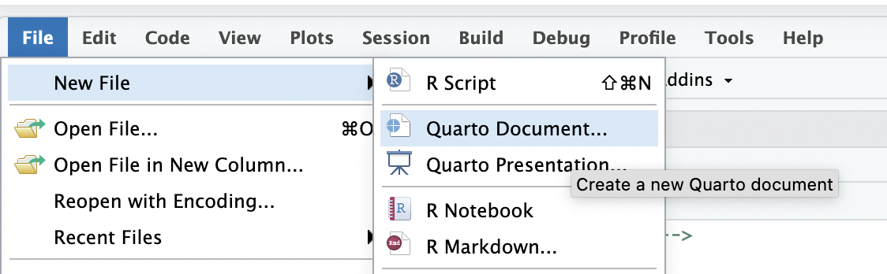

# notebook

This repo contains notebooks for practicing programming with R. A sample notebook `01-r4ds.qmd` was added. Additional notebooks can be added using the `File -> New File -> Quarto Document` dialouge in the menu bar of the RStudio IDE.

